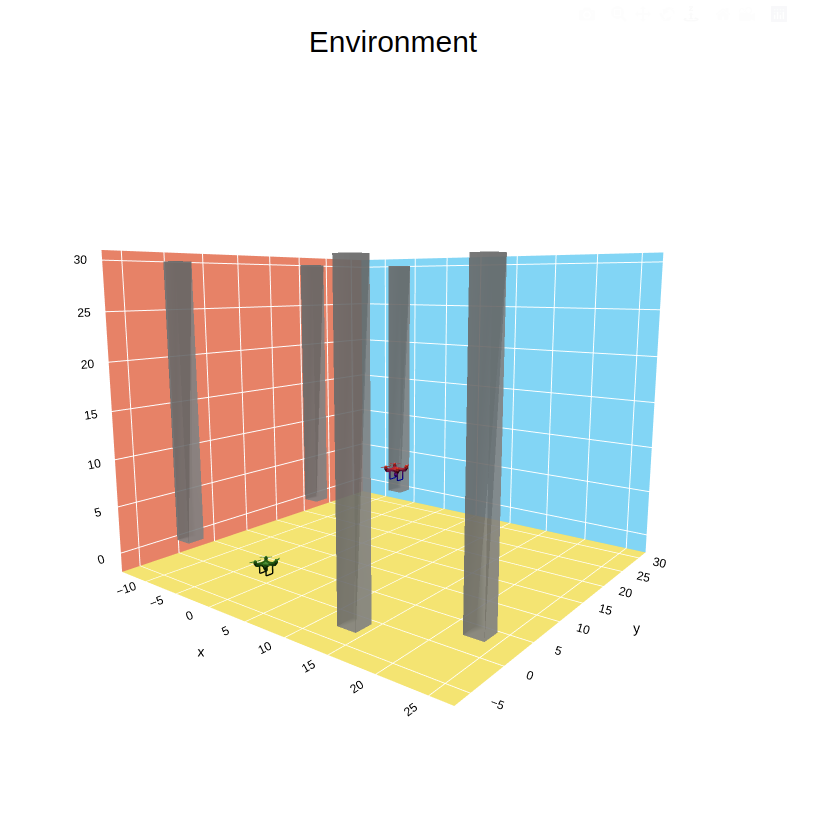

# Visualization: 
## Dependencies: 
- [numpy](https://pypi.org/project/numpy/)
- [plotly](https://pypi.org/project/plotly/) 
- [stl](https://pypi.org/project/stl/) 

### Instal dependencies

``` sh 
pip install numpy
pip install plotly
pip instal stl 
```
## runnig the code: 
- After saving your training or testing results in the file (states.npy)
- Run the celles on the nootebook. 
- The env.html file will be updated in your directory open it in your browser or relaod the page if it's already open. 
- click [simulate] to run the simulation 

